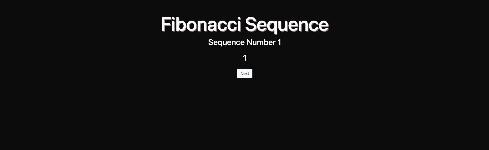
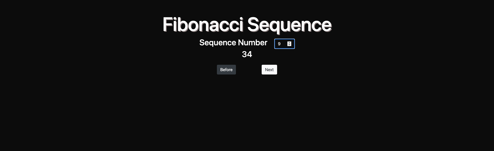

# FibonacciPages
These two pages display the results of the Fibonacci Sequence. The first page puts in practice Closures with Javascript by calling a function that returns another function. By continuosly calling the fibonacci function it computes and shows the next value in the Fibonacci Sequence. The second page makes use of the Fibonacci Sequence by requesting which number in the sequence would liked to be shown. A user can input the nth number of the sequence or decide to view the number before or the number after. 

# Images

